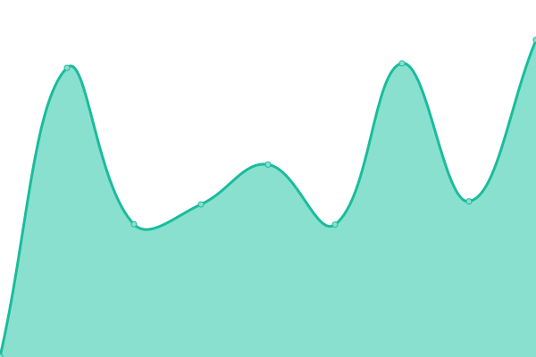

# [📈 Live Status](https://status.elythera.com): <!--live status--> **🟧 Partial outage**

This repository contains the open-source uptime monitor and status page for [Elythera](elythera.com), powered by [Upptime](https://github.com/upptime/upptime).

With [Upptime](https://upptime.js.org), you can get your own unlimited and free uptime monitor and status page, powered entirely by a GitHub repository. We use [Issues](https://github.com/Elythera/Status/issues) as incident reports, [Actions](https://github.com/Elythera/Status/actions) as uptime monitors, and [Pages](https://status.elythera.com) for the status page.

<!--start: status pages-->
<!-- This summary is generated by Upptime (https://github.com/upptime/upptime) -->
<!-- Do not edit this manually, your changes will be overwritten -->
<!-- prettier-ignore -->
| URL | Status | History | Response Time | Uptime |
| --- | ------ | ------- | ------------- | ------ |
|  [Site Principal](https://www.elythera.com) | 🟩 Up | [site-principal.yml](https://github.com/Elythera/Status/commits/HEAD/history/site-principal.yml) | 

 988ms
     
 | 

<a href="https://status.elythera.com/history/site-principal">100.00%</a>
    

|  [Nextcloud](https://nc.elythera.com) | 🟩 Up | [nextcloud.yml](https://github.com/Elythera/Status/commits/HEAD/history/nextcloud.yml) | 

 1225ms
     
 | 

<a href="https://status.elythera.com/history/nextcloud">100.00%</a>
    

|  Pterodactyl | 🟩 Up | [pterodactyl.yml](https://github.com/Elythera/Status/commits/HEAD/history/pterodactyl.yml) | 

 1176ms
     
 | 

<a href="https://status.elythera.com/history/pterodactyl">100.00%</a>
    

|  Discord | 🟥 Down | [discord.yml](https://github.com/Elythera/Status/commits/HEAD/history/discord.yml) | 

 0ms
     
 | 

<a href="https://status.elythera.com/history/discord">0.00%</a>
    

|  [Elythera Minecraft](elythera.com) | 🟥 Down | [elythera-minecraft.yml](https://github.com/Elythera/Status/commits/HEAD/history/elythera-minecraft.yml) | 

 0ms
     
 | 

<a href="https://status.elythera.com/history/elythera-minecraft">0.00%</a>
    

<!--end: status pages-->

[**Visit our status website →**](https://status.elythera.com)

## 📄 License

- Powered by: [Upptime](https://github.com/upptime/upptime)
- Code: [MIT](./LICENSE) © [Anand Chowdhary](https://anandchowdhary.com), supported by [Pabio](https://pabio.com)
- Data in the `./history` directory: [Open Database License](https://opendatacommons.org/licenses/odbl/1-0/)
